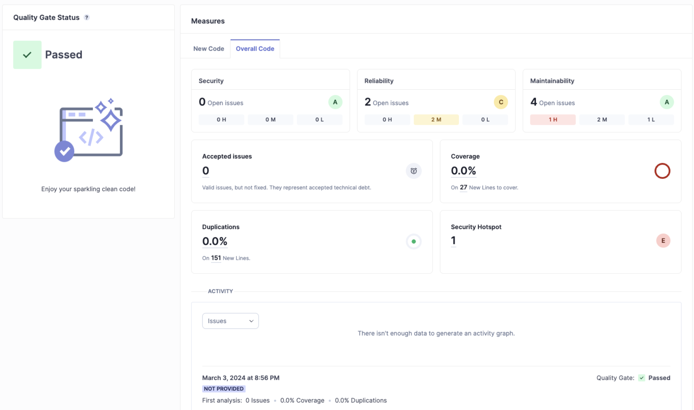
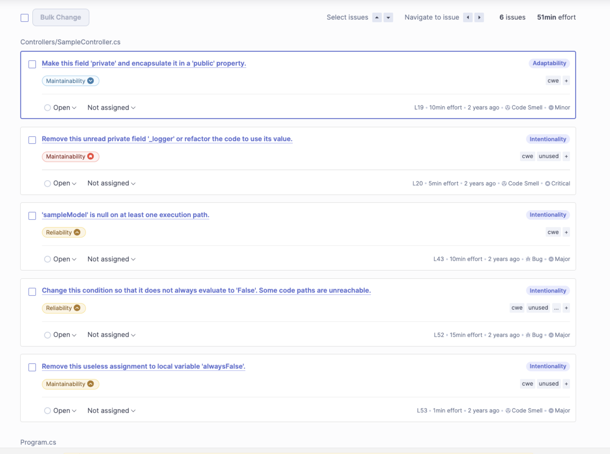
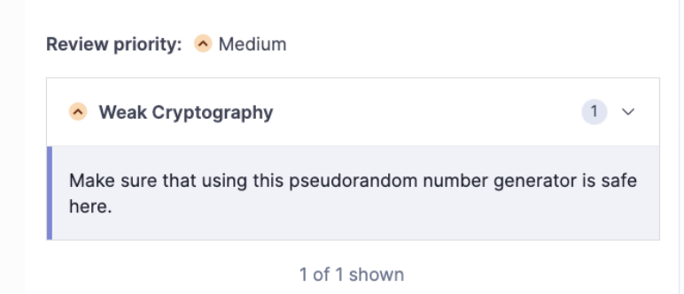

# Análise de Código com SonarQube

O SonarQube é uma ferramenta de código aberto utilizada para medir a qualidade do código em projetos de desenvolvimento de software. Ele oferece uma análise detalhada que permite aos desenvolvedores identificar problemas no código, vulnerabilidades de segurança, bugs e dívidas técnicas antes que o código seja enviado para produção. Este relatório cobre a integração do SonarQube com projetos .NET, conforme detalhado no tutorial do blog da Okta.

## Tecnologia e Conceitos Aprendidos

### SonarQube

O SonarQube analisa o código-fonte em várias linguagens de programação, incluindo .NET (C#, VB.NET, etc.), para fornecer insights e métricas que ajudam a melhorar a qualidade do código e a segurança da aplicação. Ele pode ser integrado a ambientes de desenvolvimento contínuo e sistemas de integração contínua (CI/CD) para automação de análises.

### Integração com .NET

O tutorial segue a integração do SonarQube com um projeto .NET, abordando desde a configuração do ambiente até a execução da análise de código. Os principais conceitos aprendidos incluem:

- **Configuração do SonarQube**: Instalação e configuração do servidor SonarQube, bem como a instalação do SonarScanner para .NET, uma ferramenta utilizada para executar análises de código.

- **Preparação do Projeto .NET**: Detalhes sobre como preparar um projeto .NET para análise, incluindo a adição de propriedades necessárias no arquivo de projeto (.csproj) para a correta análise pelo SonarQube.

- **Execução da Análise**: Passo a passo para executar a análise de código usando o SonarScanner, cobrindo a execução inicial, a análise propriamente dita e a publicação dos resultados no servidor SonarQube.

- **Interpretação dos Resultados**: Orientações sobre como acessar e interpretar os resultados da análise no SonarQube, identificando problemas de qualidade, vulnerabilidades de segurança e outros pontos de melhoria no código.

## Prática

O tutorial inclui exemplos práticos de comandos e configurações utilizados para integrar um projeto .NET ao SonarQube. Estes exemplos demonstram como:

- Configurar o SonarScanner e o arquivo de projeto .NET.
- Executar a análise de código e visualizar os resultados no SonarQube.

## Configuração Inicial

```bash
git clone https://github.com/oktadev/dotnet-sonarqube-example .
```

foi realizada a inicializacao do SonarQube container Docker com o comando `docker run`.

```bash
docker run -d --name sonarqube -p 9000:9000 -p 9092:9092 sonarqube
```

## Análise de Resultados no SonarQube

Após realizar a análise com o SonarQube em um ambiente local, constatei que o projeto atendeu aos padrões de qualidade estabelecidos. No entanto, foi identificado que a cobertura por testes se encontrava em 0%, sinalizando um campo importante para desenvolvimento futuro.



Nas questões identificadas, destacaram-se oportunidades de otimização, tais como ajustes nos modificadores de acesso e eliminação de variáveis não empregadas.



Adicionalmente, a análise apontou deficiências em aspectos de segurança, particularmente relacionadas a práticas de criptografia.



